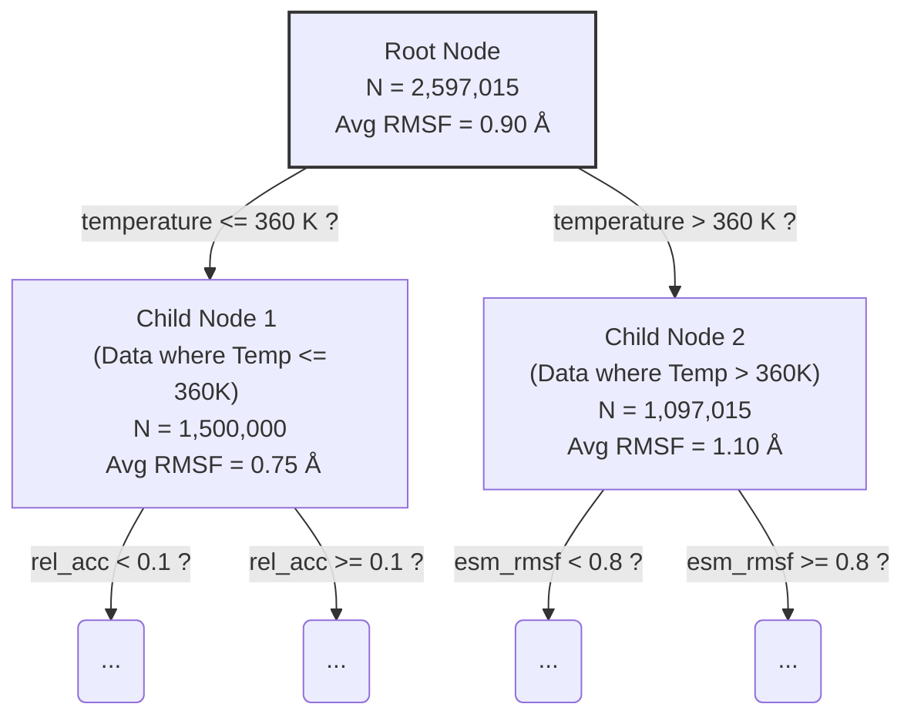
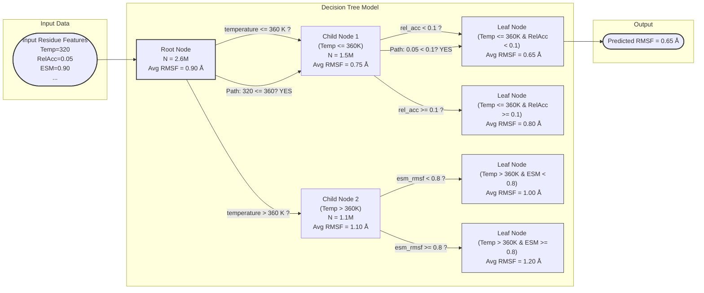

# test3

```mermaid
graph TD
    A["Root Node <br> N = 2,597,015 <br> Avg RMSF = 0.90 Å"];

    %% The algorithm evaluated splits on many features %%
    %% It found that splitting on 'temperature' first was BEST %%
    %% Specifically, splitting at 360 K gave the largest reduction in variance %%

    A -- "temperature <= 360 K ?" --> B;
    A -- "temperature > 360 K ?" --> C;

    B["Child Node 1 <br> (Data where Temp <= 360K) <br> N = 1,500,000 <br> Avg RMSF = 0.75 Å"];
    C["Child Node 2 <br> (Data where Temp > 360K) <br> N = 1,097,015 <br> Avg RMSF = 1.10 Å"];

    %% The process now repeats recursively from Child Node 1 and Child Node 2 %%
    %% E.g., Child Node 1 might split next on relative_accessibility %%
    %% E.g., Child Node 2 might split next on esm_rmsf %%

    B -- "rel_acc < 0.1 ?" --> D(...);
    B -- "rel_acc >= 0.1 ?" --> E(...);

    C -- "esm_rmsf < 0.8 ?" --> F(...);
    C -- "esm_rmsf >= 0.8 ?" --> G(...);

    style A fill:#lightblue,stroke:#333,stroke-width:2px
```

```mermaid
graph LR
    subgraph "Input Data"
        IN(["Input Residue Features <br> Temp=320 <br> RelAcc=0.05 <br> ESM=0.90 <br> ..."]);
    end

    subgraph "Decision Tree Model"
        A["Root Node <br> N = 2.6M <br> Avg RMSF = 0.90 Å"];
        B["Child Node 1 <br> (Temp <= 360K) <br> N = 1.5M <br> Avg RMSF = 0.75 Å"];
        C["Child Node 2 <br> (Temp > 360K) <br> N = 1.1M <br> Avg RMSF = 1.10 Å"];
        
        D["Leaf Node <br> (Temp <= 360K & RelAcc < 0.1) <br> Avg RMSF = 0.65 Å"]; 
        %% Final Prediction for this path %%
        
        E["Leaf Node <br> (Temp <= 360K & RelAcc >= 0.1) <br> Avg RMSF = 0.80 Å"]; 
        %% Example leaf %%
        
        F["Leaf Node <br> (Temp > 360K & ESM < 0.8) <br> Avg RMSF = 1.00 Å"]; 
        %% Example leaf %%
        
        G["Leaf Node <br> (Temp > 360K & ESM >= 0.8) <br> Avg RMSF = 1.20 Å"]; 
        %% Example leaf %%

        %% Tree Structure %%
        A -- "temperature <= 360 K ?" --> B;
        A -- "temperature > 360 K ?" --> C;
        B -- "rel_acc < 0.1 ?" --> D;
        B -- "rel_acc >= 0.1 ?" --> E;
        C -- "esm_rmsf < 0.8 ?" --> F;
        C -- "esm_rmsf >= 0.8 ?" --> G;

        style A fill:#lightblue,stroke:#333,stroke-width:2px
        style D fill:#lightyellow,stroke:#333,stroke-width:1px
        style E fill:#lightyellow,stroke:#333,stroke-width:1px
        style F fill:#lightyellow,stroke:#333,stroke-width:1px
        style G fill:#lightyellow,stroke:#333,stroke-width:1px
    end

    subgraph "Output"
        OUT(["Predicted RMSF = 0.65 Å"]);
    end

    %% Path Taken by Input Data %%
    IN --> A;
    A -- "Path: 320 <= 360? YES" --> B;
    B -- "Path: 0.05 < 0.1? YES" --> D;
    D --> OUT;


    style IN fill:#lightgreen,stroke:#333,stroke-width:2px
    style OUT fill:#lightcoral,stroke:#333,stroke-width:2px
```
