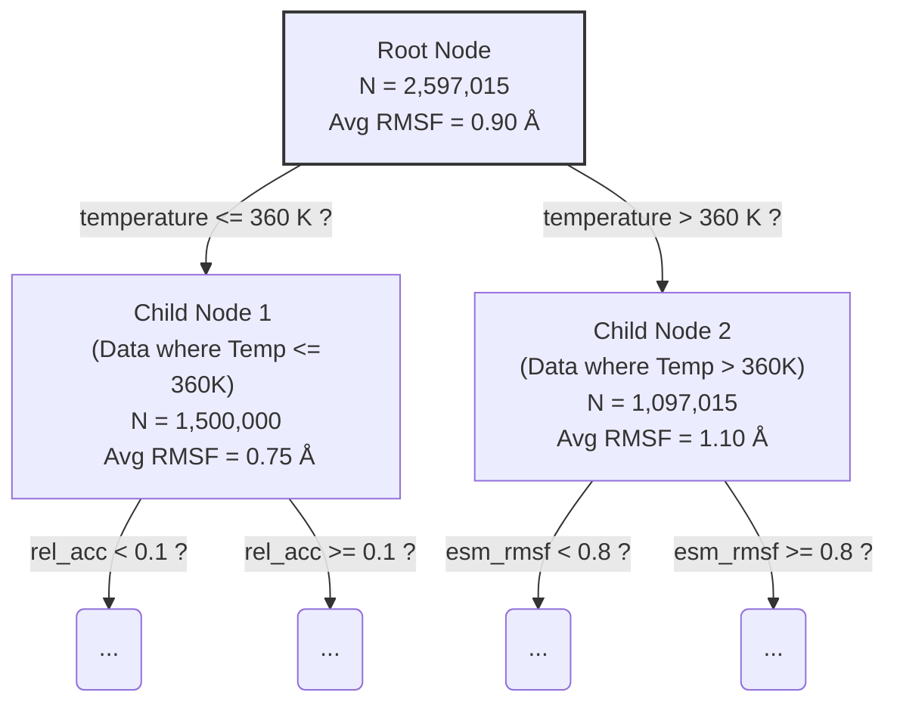

# test3

```mermaid
graph TD
    A["Root Node <br> N = 2,597,015 <br> Avg RMSF = 0.90 Å"];

    %% The algorithm evaluated splits on many features %%
    %% It found that splitting on 'temperature' first was BEST %%
    %% Specifically, splitting at 360 K gave the largest reduction in variance %%

    A -- "temperature <= 360 K ?" --> B;
    A -- "temperature > 360 K ?" --> C;

    B["Child Node 1 <br> (Data where Temp <= 360K) <br> N = 1,500,000 <br> Avg RMSF = 0.75 Å"];
    C["Child Node 2 <br> (Data where Temp > 360K) <br> N = 1,097,015 <br> Avg RMSF = 1.10 Å"];

    %% The process now repeats recursively from Child Node 1 and Child Node 2 %%
    %% E.g., Child Node 1 might split next on relative_accessibility %%
    %% E.g., Child Node 2 might split next on esm_rmsf %%

    B -- "rel_acc < 0.1 ?" --> D(...);
    B -- "rel_acc >= 0.1 ?" --> E(...);

    C -- "esm_rmsf < 0.8 ?" --> F(...);
    C -- "esm_rmsf >= 0.8 ?" --> G(...);

    style A fill:#lightblue,stroke:#333,stroke-width:2px
```
